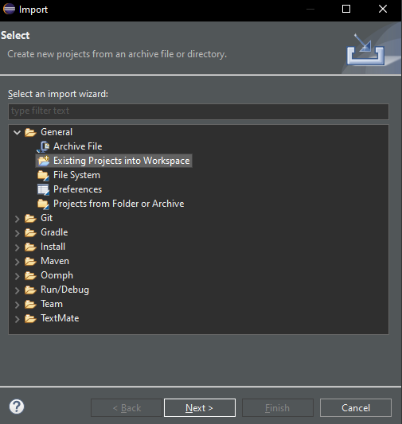
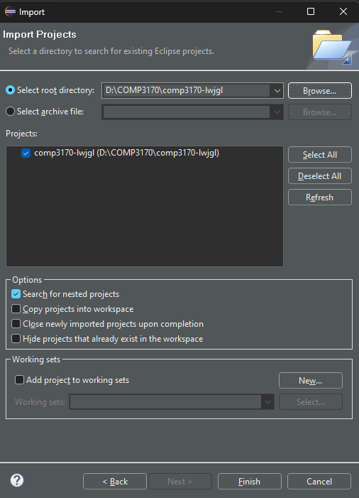
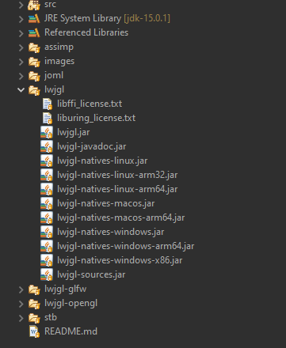
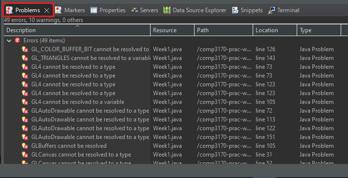
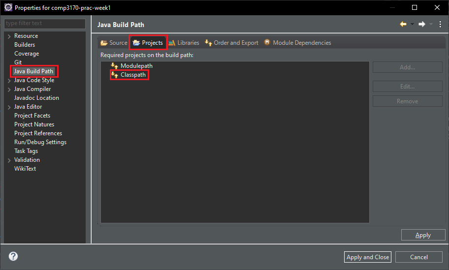
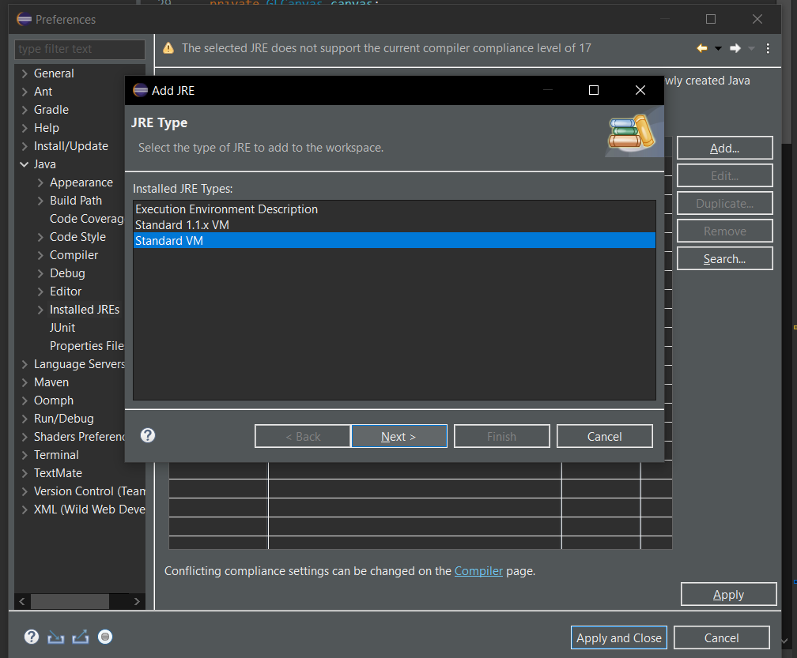
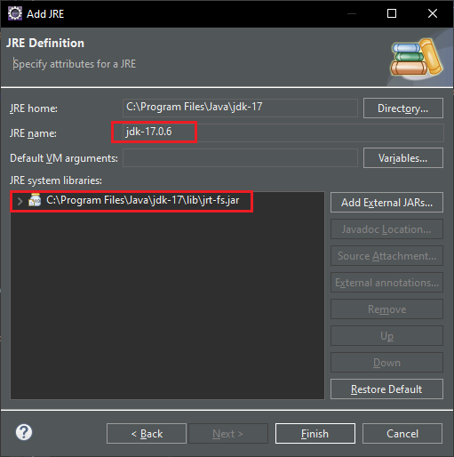
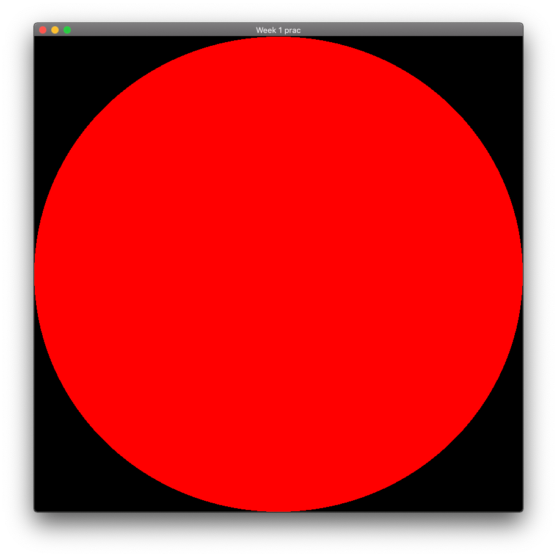
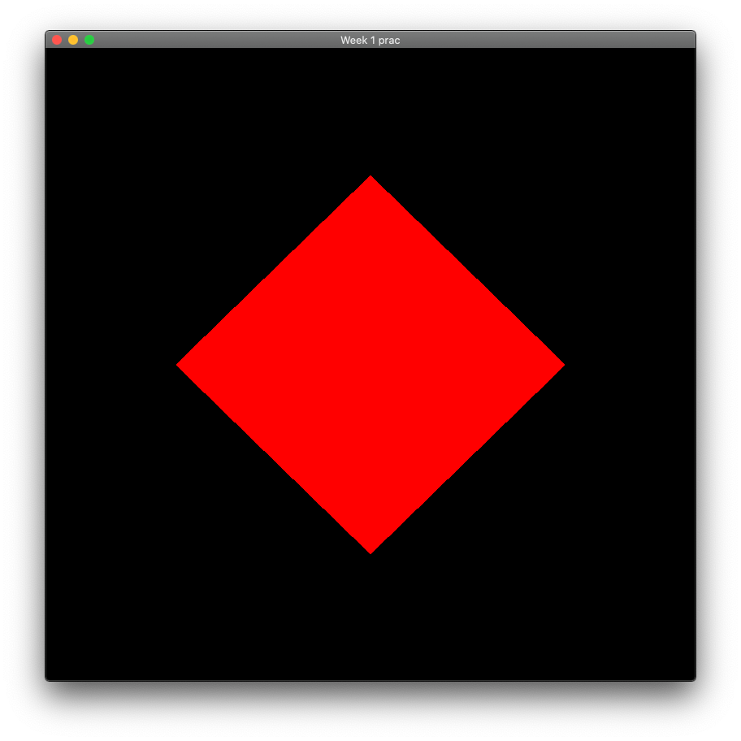

# COMP3170 – Week 1 practical task

## Topics Covered
* Introduction to OpenGL
* Setting up Eclipse with LWJGL
* Introduction to shaders

## What is OpenGL?
OpenGL has been described as “an engine for drawing triangles very fast”. As a low-level graphics API, it contains very little built-in support for achieving particular graphics effects like lighting, shadows, or even 3D. Instead, it is designed to provide an interface to allow you to program your own effects on the GPU. The disadvantage of this is there is no simple “turn on lighting” API call. The advantage, however, is that you’re not stuck with one default lighting model, you can program lights to work however you want, to add extra layers of realism or to achieve weird effects of your own.

### LWJGL
Lightweight Java Game Library (LWJGL) is a Java library which includes a wrapper that allows graphics development with OpenGL in Java. You are not expected to memorise the OpenGL function calls. Instead, we will provide you with a Java framework to avoid you having to deal with the more unpleasant parts of working with wrappers and focus on writing interesting graphics effects in shaders.

We will be using the latest version of LWJGL (3.3.1) for this unit. Installing it can be tricky, so we have set up an Eclipse project containing all the necessary files to run LWJGL on either a Mac or Windows PC. However, if you want more information on LWJGL, we recommend checking out the [website](https://www.lwjgl.org/).


## Clone the comp3170-lwjgl project
Follow this link to the Github repo of the project:
https://github.com/COMP3170/comp3170-lwjgl

Clone the project onto your machine using Github Desktop. You can store the project anywhere you want, but make sure the name of the repo is **comp3170-lwjgl**. If you are using the lab computers, we recommend you save it to the H drive to prevent needing to repeat the process every time you move computers. 
 
Open Eclipse. If you don’t have a workspace, you will be prompted to create one. Give it a meaningful name, like “COMP3170” or “Graphics Programming”.

You now want to add the repo to your Eclipse workspace.  Select File > Import … from the menu.

Select "Existing Projects into Workspace".


 
You will now be prompted to select the root directory where you cloned the project. Press <b>Browse…</b> and then select the appropriate folder. It is good practice to keep all your projects in the one folder so you can use the same root directory. 

If all goes well, the Projects list should populate with your Eclipse projects, including `comp3170-lwjgl`. Make sure the checkbox is ticked next to the lwjgl project, and press </b>Finish</b> to begin import.


 
This will add the project your Eclipse workspace. If you have a look inside the project in the Package Explorer, you should see a number of LWJGL and JOML libraries.



### Check for updates!
Throughout semester, we will occasionally be updating this library. We will announce when we make updates, but it is always a good idea to fetch and pull the latest version of the repo just in case.

## Check out the demo code & set the classpath
Today, you will experiment with some shader code to get familiar with graphics programming. Keep in mind that this is more about getting you to "think like a graphics programmer", not learn a particular technique. Like any discipline, graphics programming requires its own approach to programming and thinking about problems.

If you haven't already, clone this repo onto your computer. Then, follow the same steps to import the project into your Eclipse workspace.

Open the `Week1.java` file. The project does not know where to find your LWJGL libraries, so you should see a bunch of errors in the <b>Problems</b> panel:


 
You need to add the comp3170-lwjgl project to the classpath. From the menu select <b>Project > Properties</b> to open the properties window. Select <b>Java Build Path > Projects</b>. You should see something like this:


 
Click on <b>Classpath</b> and press the <b>Add…</b> button. <b>Select</b> the comp3170-lwjgl project from the list. Press OK.

The project should now appear on your Classpath, which will tell Eclipse where to find the missing libraries. Press Apply and Close.
 
Check the Problems panel again to make sure all the errors have been fixed.

In future pracs, this project should already be included in the Classpath. However, this is one of the first things to check if you are getting errors about not being able to find LWJGL classes or methods.

### Commit and push your changes
Remember to practice good version control. Always commit and push changes incrementally as your work, to avoid losing your work. This is a third year unit, and no sympathy will be given for students forgetting to back-up their work.


### Assigning a JDK
LWJGL 3.3.1 is a fairly well-maintained library, and works with any Java Runtime Environment above JDK 8. For this unit, we will be using JDK 17.0.5, as we know it works well with LWJGL. We will briefly cover how to ensure your lab computer is correctly configured before running any code.

---
<center><b>Working on your own device?</b> </center>

If you are working on your own device, you may want to check out the <b>COMP3170 On Your Own Computer</b> document on iLearn for more info on how to set-up Eclipse.

---

We want to make sure our workspace default JRE is set to JDK 17.0.5 (the abbreviations can be confusing). To do so, select <b>Window > Preferences</b> in Eclipse. On Mac, select <b>Eclipse > Preferences</b>.

From the directory on the right, select <b>Java</b> and the <b>Installed JREs</b> submenu. In the lab computers, you should see only one option, which is labelled "JRE". Check the directory path to see that this points to jdk-17.0.5. Your home set-up may have these labelled differently. If all is well, you can jump to "Run demo code & edit the shader".

If you can't see JDK 17.0.5 (or a JRE by another name that points to it), make sure it is installed, then return to this screen and press <b>Add…</b>. Select <b>Standard VM</b> and click <b>Next</b>.



Next to JRE home will be a <b>Directory…</b> button. Click on this and then find the folder with JDK 17.0.5 in it and click Open. If you are on the lab computers, this should just be C: > Program Files > Java > jdk-17.0.5. If all goes well, you should now see something like this:


 
You could technically enter anything you want into JRE name. I like to be specific as I often have multiple versions of Java on my machine and want to keep track of everything. Once you’re done, hit Finish, tick JDK 17.0.5, and then press <b>Apply</b> and <b>Close</b>.

Like we said, you can have multiple versions of Java at any one time, so we need to make sure that our projects are using the workplace default (which we just set). 

In the week1 project, have a look at the JRE System Library. To confirm or to change it, Right click on it and select Properties. 
 
Then, select JDK 17.0.5 by ticking Workspace Default JRE.


 Press <b>Apply</b> and <b>Close</b>.

Important info for Mac users
---
Running LWJGL code on Mac requires adding the following argument to the JVM: `-XstartOnFistThread`.

In Eclipse, this can be done in <b>Run > Run configurations > Arguments > VM arguments.</b>

If you encounter problems getting your code to run after this, speak to your tutor or consult the <b>COMP3170 On Your Computer</b> document on iLearn for workarounds and solutions. 

---

## Run demo code & edit the shader

In the package explorer, find Week1.java. Select <b>Run > Run as … > Java Application</b>.

If all goes well, you should see a window containing a red circle:



Have a look through the code in the project. In particular look at the file `fragment.glsl`. It contains the following code:

```
#version 410

uniform vec3 u_colour;	// colour as a 3D vector (r,g,b)
uniform vec2 u_screenSize;  	// screen dimensions in pixels

layout(location = 0) out vec4 o_colour;	// output to colour buffer

void main() {
vec2 p = gl_FragCoord.xy / u_screenSize; // scale p into range (0,0) to (1,1)

float d = distance(p, vec2(0.5, 0.5));  // calculate distance to midpoint  

   if (d < 0.5) {
      o_colour = vec4(u_colour, 1);
   }
   else {
      o_colour = vec4(0,0,0,1); // BLACK
   }
}
```

This is the code that draws the circle. This code is run for every fragment (i.e. pixel) in the window, to decide what colour the pixel should be. 

Note the following:
* `gl_FragCoord` is a built-in variable which contains the screen position of the fragment.

* `u_screenSize` is a uniform variable provided by the Java code which contains the width and height of the window in pixels, as a 2d vector. This is set in Scene.java lines 72-73.

* `u_colour` is a uniform variable provided by the Java code which contains a colour as an (r,g,b) vector. The value is set to (1,0,0) which is red. This is set in Scene.java lines 69-70.

* `o_colour` is the output colour which is written to the screen (i.e. buffer 0). This is a 4d (r,g,b,a) vector. We set the ‘a’ (alpha) value to 1.

Experiment with the code to make sure you understand how it works. 

Workbooks and pencils
>Drawing geometrical diagrams is an important part of graphics programming. You will be given a grid-paper workbook to draw diagrams. 
>You will be expected to bring this book (and a pencil, ruler & eraser) to every prac class. 
>Drawings don’t need to be pretty, but they should be neat and clear.

In your workbook: Draw a picture illustrating geometrically what the following shader variables mean:
* `gl_FragCoord`
* `u_screenSize`
* `p`
* `d`

In your diagram, show how the fragment colour is calculated for a point inside and a point outside of the circle.

Try changing the code:
* Change the colours of the circle and the background.

* Change the centre and diameter of the circle.

* Change line 10 to:

```
vec2 v = abs(p - vec2(0.5, 0.5));
float d = max(v.x, v.y);     
```

* What shape is drawn? Why? 

* What happens if you change `max()` to `min()`. Why?

* Why is the `abs()` function needed here? What happens if you remove it?
* How could you change the code to draw a diamond like this (Hint: draw it in your workbook first):



Notice that if you change the size of the window, the shape is stretched.	Why is the happening? How could you change the code to prevent this?

### Syntax Highlighting
There is an Eclipse Shaders extension which does GLSL syntax highlighting available here:
https://sourceforge.net/projects/glshaders/.

Download and unzip Eclipse_shaders_1_0_2.zip.

Eclipse_shaders_1_0_2 should contain two folders: features and plugins.

In file explorer, navigate to <b>Eclipse > 'your Eclipse java version' > eclipse > dropins</b>. Place both the features and plugins folders here. Restart Eclipse.

To test it has installed correctly, select <b>Window > Preferences</b>. You should now see an option called “Shaders Preferences” and a sub-option “Shaders Editor Preferences”. You can modify the colours here to get your shader code looking how you like it (especially with your new understanding of colour from this week!).


 
Now, your .glsl files should automatically open with this editor. If they don’t, right click and selected <b>Open With… > GLSL Editor</b>.
 
### To receive a mark for today, show your tutor:
* Your set-up Eclipse workspace.
* Your workbook diagram of the diamond.
* Your fragment shader diamond code and output.
